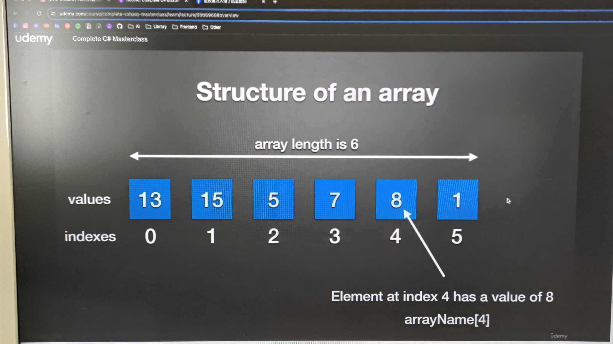

# Basic of Arrays

---



- Store a fixed size sequential collection of elements
- **ONLY** of the same type.
- All kinds of types: `int`, `string`, `object`, etc.
- Great to store a collection of data - easier to think of a collection of variables of the same type stored at contiguous memory location.

### Declaring an array

```csharp
DataType[] arrayName;

//Example
int[] grades;
```

### Initializing an array

```csharp
dataType[] arrayName = new dataType[amountOfEntries];

//Exapmle
int[] grades = new int[5];
```

### Assigning values to an array

```csharp
arrayName[index] = value;

// Example
grade[0] = 15;
grade[1] = 12;
```
